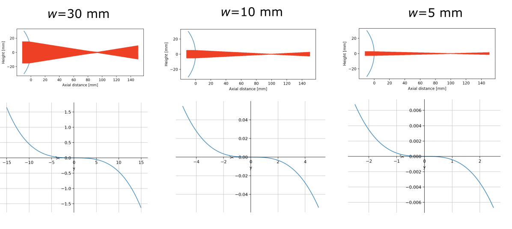

# Aspheric

This code helps understanding the raytracing of the plano-convex aspheric lenses, the motivation of the use of the paraxial approximation and how to choose the right conic constant for the design.

## User parameters

The user specifies in the code various parameters for the lens and the simulation.

- `kappa`: conic constant $\kappa$ ;
- `d`: diameter of the plano convex lens [mm] ;
- `R`: radius of curvature of the lens [mm]. For a convex lens, the radius of curvature must be a negative value.
- `n`: refractive index of the lens ;
- `L`: propagation length behind the lens [mm] ;
- `n_ray`: number of rays incident on the surface ;
- `n_pt`: number of points that constitute the aspheric surface ;
- `w`: incident beam diameter [mm].


## Outputs graphs

### Raytracing

The first figure shows the sag of the plano-convex lens (blue line on the left) and the specified number of rays equally repartited on the surface according to the beam diameter. The rays propagate for the distance specified by the user. Note that the vertex of the lens is coincident with the axial distance equal to zero. 


### Ray fan plot

The second figure displays the ray fan plot: the distance to the axis at the focal spot in respect to the height of the incident ray. This plots gives rapid information about the amount of spherical aberration produced by the lens. 


## Theory behind the code

Aspheric lenses are used to compensate spherical aberrations (spread of the focal point on the axis). By optimizing the shape of the lens, one can control the deflection of the rays in order to make them converge on a single point. 

Let's define $z$ being the axial distance from the origin and $y$ the height. An aspheric surface has a profile given by:
$$
z = \frac{y^2}{R\left(1+\sqrt{1-(1+\kappa)\frac{y^2}{R}}\right)},
$$
Where $R$ is the radius of curvature of the lens and $\kappa$ is the conic constant of the surface. The choice of $R$ is directly linked to the focal length $f$ of the lens in the following way:
$$
f = \frac{-1}{\frac{1}{R}(n-1)},
$$
where $n$ is the refractive index of the material of the lens. Note that we assume that the lens is surrounded by air of refractive index of 1. 


## Examples

### Spherical lens

For a spherical lens, $\kappa=0$. In general, in optics, we assume that lenses have a spherical shape since we often use paraxial approximation. In this example, we will show that a spherical lens is free of sperical aberration only for rays in the paraxial region. 

As an input, let's define the parameters to have a sperical lens made of BK7 glass ($n=1.5168$) with a focal length of 100 mm:

```python
kappa = 0
d = 60
f = 100
n = 1.5168
L = 150
n_ray = 13
n_pt = 100
w = 50
```

Notice that we chose a lens diameter of 60 mm and a beam diameter that almost covers all its aperture (50 mm). On the raytracing figure, one can clearly see the presence of the spherical aberration.


When we rise the number of rays $n_{ray}$ to 500 to have a smoother rayfan plot, one can get the following graph:

 

The shape of the curve shows that we have *** aberration. The obtained value of 10 confirms that we have great amount of aberrations. Let's run the code again, but with lower values of the beam diameter.



Thus, we conclude that the use of a spherical lens is a good choice when the paraxial approximation is valid.

